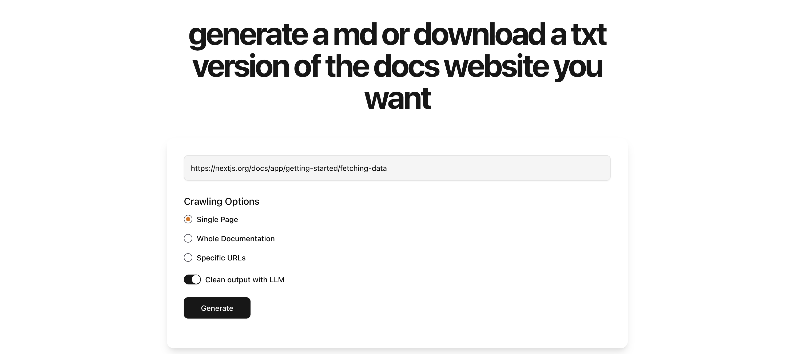
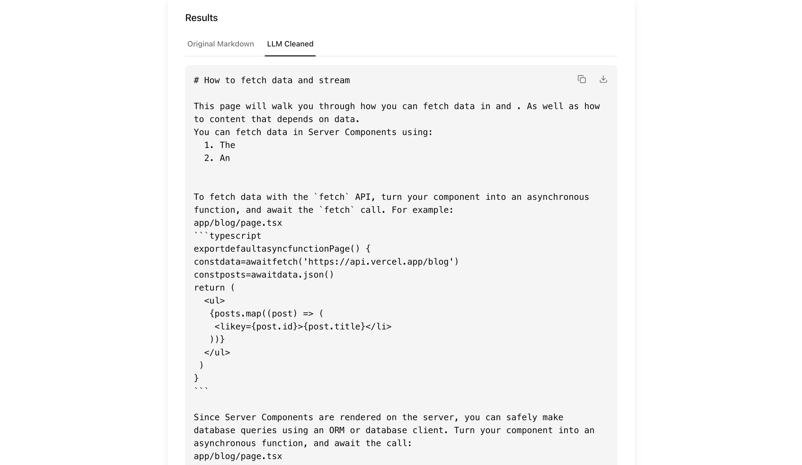

# docs-to-llm

i was working on a different project and spent a bit too long copy pasting docs into LLMs so that the models can get the most up to date info on a library, so i made this little side project to crawl the docs page into an easily digestable format for LLMs. ik theres models that can do searches and stuff but it didn't work too well for me, and also you can use MCP to connect models to internet as well e.g exa MCP but that comes at a cost, and gemini has a free tier.

this is docs-to-llm! a web app that lets you just put in a documentation page and you can save or copy paste the output of the docs page into an LLM.

enjoy :) feel free to make any PR if you wanna improve what i did.

## picture of app





## how to setup

### frontend
```zsh
cd frontend
npm run dev
```

### backend

dont forget to make a .venv, i used *python version 3.13.3*

```zsh
cd backend
pip install -r requirements.txt

crawl4ai-setup
```

